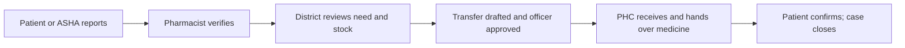

# Saathi · साथी

Saathi helps patients with diabetes or high blood pressure get a missed medicine refill resolved at a government health centre.

**Live demo:** https://saathi-drab.vercel.app

Free server: first load can take up to a minute; the app shows a waking-up screen.

## The problem

- India has 10.1 crore people with diabetes and 31.5 crore with hypertension (ICMR-INDIAB-17, *Lancet Diabetes Endocrinology*, 2023).
- In test-checked Uttar Pradesh PHCs, up to 16 of 20 sampled drugs were never available in 2018–22. This was a maximum among sampled facilities, not a state rate (CAG audit of UP health services, 2024).
- When stock runs out, dispensing records miss demand from patients who leave without medicine (*Demand forecasting under lost sales stock policies*, *International Journal of Forecasting*, 2023).

## Try it in 2 minutes

At [the live demo](https://saathi-drab.vercel.app/login), choose **English** or **हिन्दी**. The demo logins have no passwords:

| Person | Role | Demo user |
| --- | --- | --- |
| Ramesh | Patient | `patient-user-001` |
| Rekha | ASHA worker | `asha-1` |
| Sunita | Pharmacist | `pharmacist-1` |
| Dr. Mehra | District officer | `officer-1` |

To switch roles, select **Profile** → **Log out**. The district screen also has **Log out** in its sidebar.

Follow Ramesh's story:

1. On **Login**, select **Reset demo data**, then log in as **Ramesh**.
2. Select **Medicine not received** → **Type instead**. Check metformin, enter **30** tablets requested and **0** days left at home, then select **Confirm & send**.
3. Log in as **Sunita**. Open Ramesh's report in **Verify Queue**, set the shelf count to **0**, choose **Out of stock**, and select **Confirm finding**.
4. Log in as **Dr. Mehra**. In **District Overview**, find the case, select **Draft transfer**, review the checks and rationale, then select **Approve transfer** → **Mark dispatched**.
5. Log in as **Sunita**. Open **Incoming Transfers**, select the transfer, then **Mark received** → **Give to patient** → **Hand over medicine**.
6. Log in as **Ramesh**. Open **Reports** → his case, then select **Yes, I received it**. The case closes. Dr. Mehra can see its full history in **Case Board**.

**Reset demo data** restores the synthetic seed and deletes current demo cases. It is available on the login screen.

## Features (shipped)

| Feature | Who uses it | What it does |
| --- | --- | --- |
| Hindi voice report with read-back; manual form | Patient, ASHA | Reviews the transcript and editable fields before sending a missed-refill report. |
| Reports for assigned patients | ASHA | Reports a missed refill on behalf of a patient she covers. |
| Report versus confirmed stock-out | Pharmacist | Checks the shelf before a reported shortage becomes a confirmed stock-out. |
| District overview | District officer | Shows cohort need beside the dispensing forecast, stock age, days left, and warnings. |
| OR-Tools transfer draft, Gemini rationale, officer approval | District officer | Checks donor reserve, expiry, and units; an officer decides whether to approve. |
| Dispatch, receive, hand over, close | Officer, pharmacist, patient | Records each step in the case's full audit trail. |
| “Medicine arrived” alerts | Patient, ASHA | A bell and list show notices; an arrived banner appears while medicine waits at the PHC. |
| Offline reporting | Patient, ASHA | Saves reports on the phone, sends them on reconnect, avoids duplicates, and flags refused reports. |
| Waking-up screen | Everyone | Explains the wait while the free API server starts. |
| Hindi and English UI | Everyone | Shows both languages across the app. |
| Demo reset | Everyone | Restores the synthetic scenario for a fresh walkthrough. |
| Evaluation page | District officer | Shows the synthetic forecast comparison and its limits. |

## How it works

1. A patient or ASHA reports a missed refill. Voice fields are read back for human confirmation.
2. A pharmacist checks stock. Until then, the shortage is only a report.
3. The district compares prescription-based cohort need with a separate dispensing forecast, stock, and warnings.
4. OR-Tools drafts an eligible transfer. Gemini may explain it. An officer approves or rejects it.
5. Staff dispatch and receive the stock, hand over medicine, and the patient confirms receipt. The case closes with an audit trail.



## Tech

- **FastAPI + SQLite:** API, case history, and synthetic demo data.
- **Next.js PWA:** Installable patient, ASHA, pharmacist, and district screens.
- **Gemini:** Hindi voice extraction and wording for transfer rationales, with a labeled fallback.
- **OR-Tools:** Transfer selection under stock, expiry, and unit checks.
- **IndexedDB:** Offline report queue; sync uses operation IDs to avoid duplicates.
- **Render + Vercel:** Hosts the API and web app.

## Tests

- Backend: `cd backend && .venv/bin/pytest -q` → **119 passed, 1 skipped, 1 warning** on 29 Sep 2026.
- Browser stories: [Ramesh](frontend/e2e/ramesh.spec.ts), [ASHA voice](frontend/e2e/voice-asha.spec.ts), and [ASHA offline](frontend/e2e/offline-asha.spec.ts). **All three passed against the live app on 29 Sep 2026**, and locally.

From `frontend/`, the live-run command is:

```sh
BASE_URL=https://saathi-drab.vercel.app API_BASE=https://saathi-api-gm4i.onrender.com npx playwright test e2e/ramesh.spec.ts e2e/voice-asha.spec.ts e2e/offline-asha.spec.ts
```

## Honest evaluation

The [forecast experiment](backend/eval/results/forecast.md) generates patient need independently of the tested methods, then simulates incomplete enrollment, stock-limited dispensing, and other stressors. These are **simulator outcomes**, not measured health impact. In the baseline, the **experimental combined method** had mean absolute error of **3.81 units/day**, versus **4.98** for dispensing-only. Both had **227.58 unmet patient-days**; prescription-only had **3.33**, but **389.19 mean overstock units** versus combined's **0.02**. Under stale prescriptions, experimental combined error rose to **17.51 units/day** and overstock to **236.45 units**, versus dispensing-only's **3.57** and **0.97**. The shipped product still defaults to the separate `max` rule; the experimental combined method is not its default. Lower error in one scenario does not establish fewer missed refills.

The [text-only Hindi/Hinglish test](docs/notes-codex.md#b16b19-continuation-29-sep-2026) received **26 live answers out of 30** synthetic transcripts; **4** calls failed. Across all **30**, medicine accuracy was **0.867**, requested quantity **0.833**, household supply days **0.867**, and negation in the transcript **0.967**. This test did **not** test speech recognition. Facility and received quantity are outside the product extraction schema, so their zero scores are not model accuracy scores.

The latest [audio evaluation](backend/eval/results/audio.md) sent **12 synthetic Hindi TTS clips** through the voice API. All **12/12** received live Gemini responses; medicine, requested quantity, household days, and spoken date each matched the scripted labels in **12/12** clips. Mean API latency was **5.96 seconds**. The transcript check was limited to script facts and Devanagari presence, not word error rate. A **single real WhatsApp Ogg/Opus clip** was a general health complaint, **not a refill report**. Its standalone live retry classified it as `not_a_refill_report: true` with all audio-extracted fields null; an earlier paced call fell back and provided no classification evidence. **Real speech is barely tested**: this one negative clip says nothing about accuracy on real refill requests, dialects, noisy clinics, or varied phones.

## Safety and data limits

- All seeded patients, facilities, stock records, and forecast scenarios are **Synthetic demo data**. The Hindi TTS clips are synthetic too. One separately evaluated WhatsApp audio clip is a real human voice, used only for the stated voice test; it is not a patient record in the app.
- The voice review screen marks missing fields and requires a human to complete them before case creation. A non-refill statement must not be turned into a refill case. Model text is screened for medication advice and invented blood-sugar numbers; the filter is limited and is not a clinical safety classifier.
- Transfer drafts need an officer's approval. Dispatch checks stock again. If no donor can satisfy the constraints, the engine reports no feasible transfer instead of inventing one.
- Demo role selection is not secure identity verification. SQLite demo storage, browser offline sync, and simulated forecasts need field validation and operational controls before real use.

## Roadmap (not built)

The following phases are from the product plan, section 0.6. They are **not built**:

- **Phase 1 — Harden for rounds:** Improve demo scenarios, add a read-only doctor QR summary and ASHA task view, and interview field staff.
- **Phase 2 — Pilot-ready:** Add stock-register photo reading, DVDMS CSV exchange, consent and privacy controls, WhatsApp/IVR, and a pilot protocol.
- **Phase 3 — Pilot:** Run in one block and measure real stock-out days, patients without medicine, private spending, and alert lead time.
- **Phase 4 — Full AI:** Research meal and glucose models, clinical summaries, censored-demand forecasting, federated demand modelling, and an attendance signal.
- **Phase 5 — Scale:** Add health-system integrations, a native app, state-specific settings, regulatory review, and partner screening services.

## Run locally

Use Python 3.11 and a Node.js installation compatible with the pinned Next.js release. From the repository root, start the API:

```sh
python3.11 -m venv backend/.venv
backend/.venv/bin/python -m pip install -e 'backend[dev]'
cd backend
DEMO_MODE=1 .venv/bin/uvicorn app.main:app --port 8000
```

In another terminal, start the web app:

```sh
cd frontend
npm ci
NEXT_PUBLIC_DEMO_MODE=1 npm run dev
```

Open `http://localhost:3000`. The frontend uses `http://localhost:8000` by default; set `NEXT_PUBLIC_API_BASE` to another backend origin when needed. The backend reads `GEMINI_API_KEY` from its environment or ignored `backend/.env`; without a key it uses a labeled deterministic fake. Never put the key in `NEXT_PUBLIC_` variables. See [frontend setup](frontend/README.md), [backend setup](backend/README.md), and [deployment steps](docs/DEPLOY.md).
